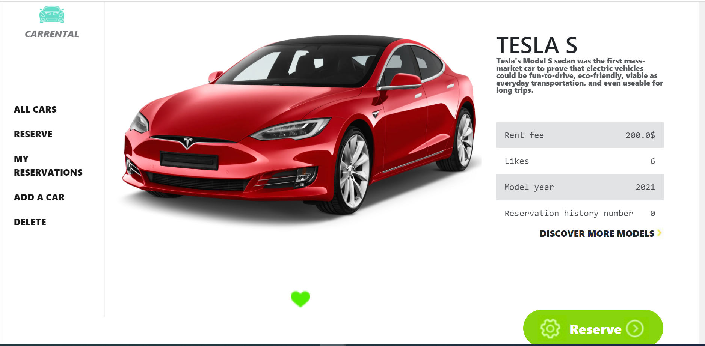
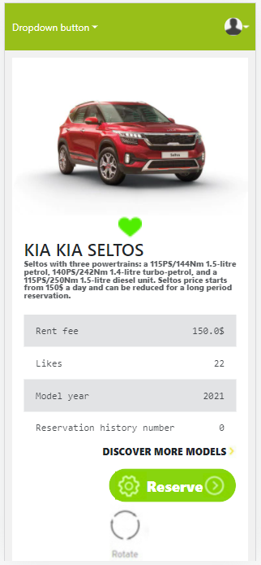
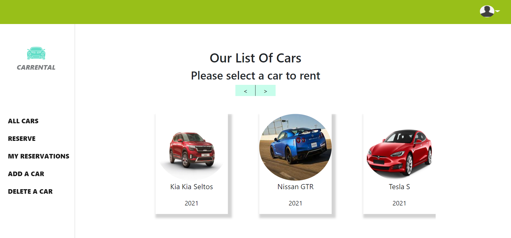
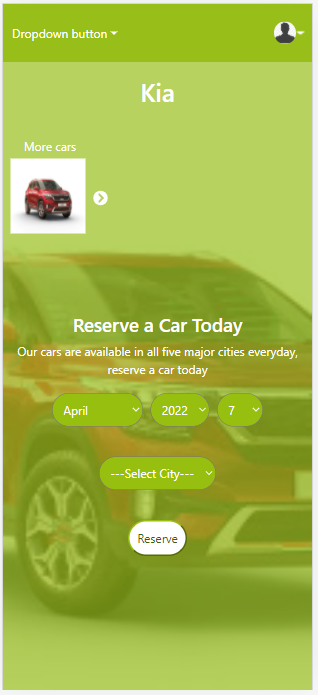

# CARRENTALS
- In this Project, We created a Car service Webapp where users can add cars, a pop up page feature where users who is an admin can delete cars, The delete button is disabled for non-admin. There is an added feature for users to make reservation for the cars with easy access to all the available cars.

## Project Preview

Desktop-details                          |  Mobile-details
:---------------------------------------:|:---------------------------------------:
        |    

Desktop-Home                             |  Mobile-reserve
:---------------------------------------:|:---------------------------------------:
           |   


## Kaban board

Kaban Before                             |  Kaban After
:---------------------------------------:|:---------------------------------------:
        |    

> [Link to Kaban Board](https://github.com/Taher-web-dev/car-rent-rails/projects/1)
> Total Number of Team members : 4


## Front-end Live Demo
> Click [here](https://mic-car-rental.netlify.app/) to see the live preview of the project.

> [link to Backend](https://github.com/Taher-web-dev/car-rent-rails)

### Built With

- [React](https://es.reactjs.org/)
- [HTML](https://www.w3schools.com/html/)
- [CSS](https://www.w3schools.com/css/)
- [JS](https://www.javascript.com/)

# Getting Started with Create React App

This project was bootstrapped with [Create React App](https://github.com/facebook/create-react-app).

### Installation

1. Clone the repository
   ```sh
   git clone https://github.com/Taher-web-dev/car-rent-front-end.git
   ```
2. Install NPM packages
   ```sh
   npm install
   ```
3. Run server
   ```sh
   npm start
   ```
## Authors

👤 **Okpara Tochukwu**

- GitHub: [@xtrahuman](https://github.com/xtrahuman)
- LinkedIn: [LinkedIn](https://linkedin.com/in/tochukwuokpara)

👤 **Taher Haggui**

- GitHub: [@Taher-web-dev](https://github.com/Taher-web-dev)
- LinkedIn: [LinkedIn](https://www.linkedin.com/in/taher-haggui/)

👤 **Daniel Shdeed**

- GitHub: [@Danieldotcomcoder](https://github.com/Danieldotcomcoder)
- LinkedIn: [LinkedIn](https://www.linkedin.com/in/daniel-shdeed/)
- Twitter: [twitter](https://twitter.com/DannyDotcoder)

👤 **Gabriel Nwachukwu**

- GitHub: [@codepriest](https://github.com/gabrielcoder247)
- LinkedIn: [@codepriest](https://www.linkedin.com/in/gabriel-nwachukwu-209613173/)

## 🤝 Contributing

Contributions, issues, and feature requests are welcome!

Feel free to check the [issues page](../../issues/).

## Acknowledgments

Original design idea by Murat Korkmaz on Behance.

## Show your support

Give a ⭐️ if you like this project!
